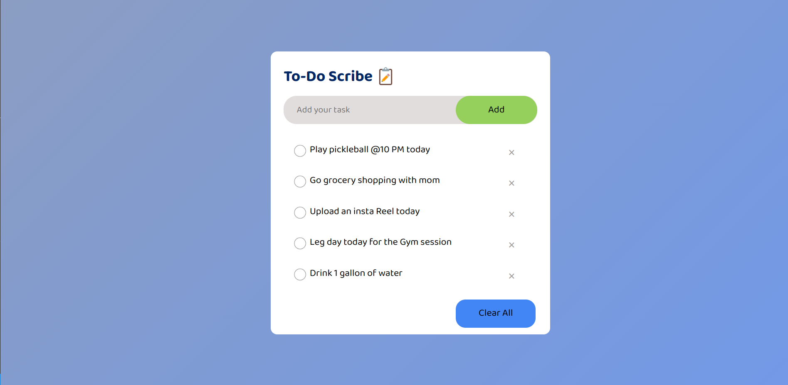
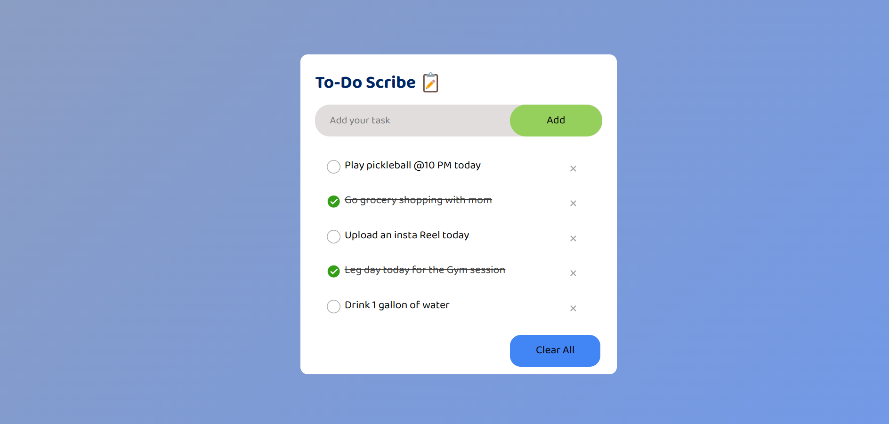
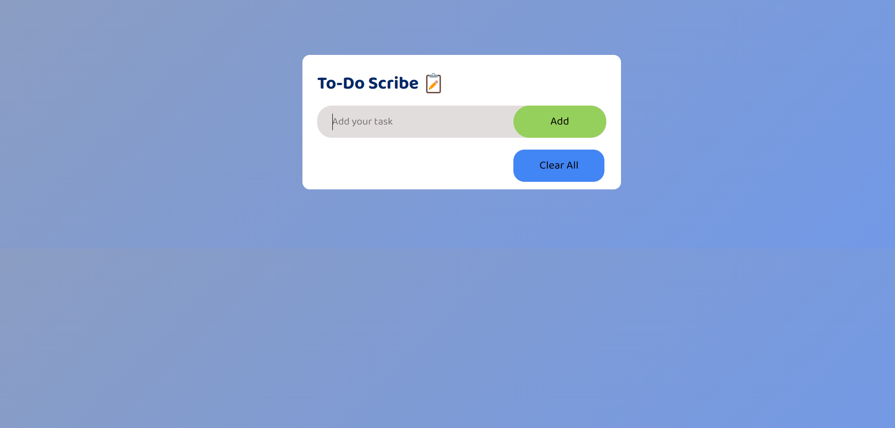

# To-Do Scribe App

The ToDo Scribe App is a simple web application that allows users to create and manage their to-do lists. It provides basic functionalities like adding tasks, marking tasks as done, and clearing the task list with a single click button. Additionally, the app uses browser local storage to store the task list, allowing users to persist their tasks across browser sessions.

## Features

- **Add Task**: Users can add new tasks to their to-do list using the input field provided.
- **Mark Task as Done**: Users can mark tasks as done by clicking on the checkbox next to each task.
- **Remove Task**: User can remove the task individually by clicking on the remove icon.
- **Clear Task List**: Users can clear the entire task list with a single click of the "Clear All" button.
- **Local Storage**: The app utilizes browser local storage to store the task list, ensuring that tasks are persisted even after refreshing the page or closing the browser.

## Technologies Used

- HTML
- CSS
- JavaScript

## How to Use

1. Clone the repository to your local machine.
2. Open the `index.html` file in your web browser.
3. Use the input field to add new tasks to your to-do list.
4. Click on the checkbox next to each task to mark it as done.
5. Click the "Clear All" button to clear the entire task list.
6. Your task list will be automatically saved to your browser's local storage.

## Demo

You can view a live demo of the ToDo Scribe App [here](#).

## Screenshots

## Contributing

Contributions are welcome! If you have any suggestions, bug fixes, or improvements, please feel free to open an issue or submit a pull request.
